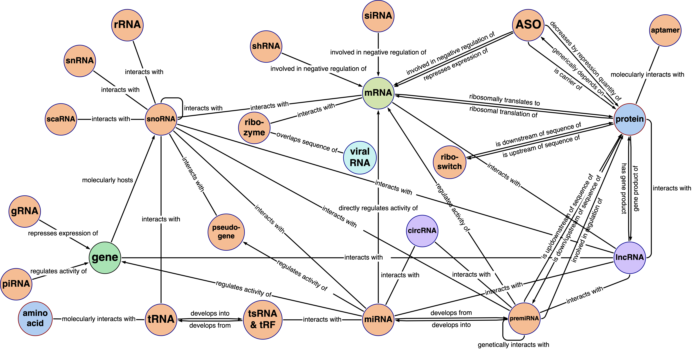
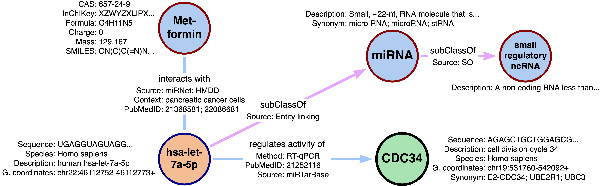

****************************************************************************************************************
RNA-KG v2.0: An ontology-based KG for representing interactions involving RNA molecules enriched with properties
****************************************************************************************************************

RNA-KG is a knowledge graph encompassing biological knowledge about RNAs gathered from `more than 90 public databases <#list-of-integrated-sources>`_, integrating functional relationships with genes, proteins, and chemicals and ontologically grounded biomedical concepts. Relationships are characterized by standardized properties that capture the specific context (e.g., cell line, tissue, pathological state) in which they have been identified. In addition, the nodes are enriched with detailed attributes, such as descriptions, synonyms, and molecular sequences sourced from platforms such as OBO ontologies, NCBI repositories, RNAcentral, and Ensembl. RNA-KG can be both used by directly exploring and visualizing the KG, and by applying computational methods to analyze and infer bio-medical knowledge. RNA-KG is constantly maintained and updated with new experimental data. More details can be found in `RNA-KG v1.0 article`_ and `RNA-KG v2.0 pre-print`_.

****************************************************************************************************************

|metagraph| Excerpt of the RNA-KG schema

****************************************************************************************************************

|sample| Excerpt of a RNA-KG subgraph

****************************************************************************************************************

What Does This Repository Provide?
===================================
- Notebooks and pointers to processed data and ontologies to build the current release of RNA-KG.
- Code for reproducing experiments described in the `RNA-KG v2.0 pre-print`_ (Applications and Use Cases section).

Releases
========= 
- RNA-KG v2.0 website: https://RNA-KG.biodata.di.unimi.it  
- Public Neo4j endpoint: https://neo4j.biodata.di.unimi.it (`usr`: rnakgv20, `pwd`: rnakgv20)
- Database dump: https://RNA-KG.biodata.di.unimi.it/rnakgv20.dump; raw nodes list: https://RNA-KG.biodata.di.unimi.it/nodes.csv; raw edges list: https://RNA-KG.biodata.di.unimi.it/edges.csv (raw data are available on `Zenodo`_)    
- RNA-KG v2.0 API docs: https://RNA-KG.biodata.di.unimi.it/api/v1/docs  
- RNA-KG v2.0 pre-print: https://www.arxiv.com/xx; RNA-KG v1.0 paper: https://www.nature.com/articles/s41597-024-03673-7

|

---------------------------------

********************************
Generate RNA-KG current release
********************************

The current release can be generated via the four provided Jupyter Notebooks in the `notebooks` directory.  
`main.py` is used by the first notebook to process ontologies according to PheKnowLator's implementation of OWL-NETS.

Steps:

1. Download, clean, and generate the ontology graph by merging the 11 ontologies describing the RNA-KG metagraph/schema.

2. Define and generate lookup tables for normalizing entities according to standard identifiers.

3. Process relationships from the 80 linked open data repositories, including edge properties.

4. Add node properties and link them to ontology terms.

Finally, import the generated CSV files into Neo4j:

.. code-block:: bash

    sudo bin/neo4j-admin database import full "RNA-KGv2.0" \
        --nodes=neo4j/import/nodes.csv \
        --relationships=neo4j/import/edges.csv \
        --overwrite-destination \
        --verbose \
        --skip-duplicate-nodes \
        --skip-bad-relationships \
        --multiline-fields=true

**************************
List of integrated sources 
**************************

RNA-KG is a knowledge graph encompassing biological knowledge about RNAs gathered from 91 linked open data repositories and ontologies. Here, we list integrated sources and ontologies.  
Special thank to `DrugBank <https://go.drugbank.com/>`_ for liking this project and making me access supplementary data!

- RNA-centered sources: `miRBase <https://www.mirbase.org/>`_; `miRDB <https://mirdb.org/>`_;  `miRNet <https://www.mirnet.ca/miRNet>`_; `miRecords <http://c1.accurascience.com/miRecords/download_data.php?v=4>`_; `EpimiR <http://www.jianglab.cn/EpimiR/index.jsp>`_;  `HMDD <https://www.cuilab.cn/hmdd>`_; `miR2Disease <http://watson.compbio.iupui.edu:8080/miR2Disease/>`_; `TargetScan <https://www.targetscan.org/vert_80/>`_; `SomamiR DB <https://compbio.uthsc.edu/SomamiR/>`_; `TarBase <https://dianalab.e-ce.uth.gr/html/diana/web/index.php?r=tarbasev8/index>`_; `miRTarBase <https://mirtarbase.cuhk.edu.cn/~miRTarBase/miRTarBase_2022/php/index.php>`_; `SM2miR <http://www.jianglab.cn/SM2miR/>`_; `TransmiR <https://www.cuilab.cn/transmir>`_; `PolymiRTS <https://compbio.uthsc.edu/miRSNP/>`_; `dbDEMC <https://www.biosino.org/dbDEMC/index>`_; `TAM <http://www.lirmed.com/tam2/>`_; `PuTmiR <https://www.isical.ac.in/~bioinfo_miu/TF-miRNA1.php>`_; `miRPathDB <https://mpd.bioinf.uni-sb.de/overview.html>`_; `miRCancer <http://mircancer.ecu.edu/>`_; `miRdSNP <http://mirdsnp.ccr.buffalo.edu/index.php>`_; `miRandola <http://mirandola.iit.cnr.it/index.php>`_; `ICBP siRNA <http://web.mit.edu/sirna/index.html>`_; `Apta-Index <https://www.aptagen.com/apta-index/>`_; `eSkip-Finder <https://eskip-finder.org/cgi-bin/input.cgi>`_; `Addgene <https://www.addgene.org/>`_; `LncBook <https://ngdc.cncb.ac.cn/lncbook/>`_; `LncRNADisease <http://www.rnanut.net/lncrnadisease/>`_; `LncExpDB <https://ngdc.cncb.ac.cn/lncexpdb/>`_; `dbEssLnc <https://esslnc.pufengdu.org/home>`_; `lncATLAS <https://lncatlas.crg.eu/>`_; `NONCODE <http://www.noncode.org/index.php>`_; `Lnc2Cancer <http://bio-bigdata.hrbmu.edu.cn/lnc2cancer/>`_; `LncRNAWiki <https://ngdc.cncb.ac.cn/lncrnawiki/>`_; `LncBase <https://diana.e-ce.uth.gr/lncbasev3>`_; `TANRIC <https://www.tanric.org/>`_; `Ribocentre <https://www.ribocentre.org/>`_; `Rfam <http://rfamlive.xfam.org/>`_; `ViroidDB <https://viroids.org/>`_; `TBDB <https://tbdb.io/>`_; `RSwitch <https://penchovsky.atwebpages.com/applications.php?page=58>`_; `tRFdb <http://genome.bioch.virginia.edu/trfdb/index.php>`_; `tsRFun <https://rna.sysu.edu.cn/tsRFun/index.php>`_; `MINTbase <https://cm.jefferson.edu/MINTbase/>`_; `snoDB <https://bioinfo-scottgroup.med.usherbrooke.ca/snoDB/>`_; `tRNAdb <http://trna.bioinf.uni-leipzig.de/DataOutput/>`_; `GtRNAdb <http://gtrnadb.ucsc.edu/GtRNAdb2/index.html>`_; `piRBase <http://bigdata.ibp.ac.cn/piRBase/index.php>`_; `iPiDA-GCN <http://bliulab.net/iPiDA-GCN/>`_; `TarpiD <https://tarpid.nitrkl.ac.in/tarpid_db/>`_; `RNAInter <http://www.rnainter.org/>`_; `RNALocate <http://www.rna-society.org/rnalocate/>`_; `RNADisease <http://www.rnadisease.org/>`_; `ncRDeathDB <https://www.rna-society.org/ncrdeathdb/>`_; `cncRNADB <http://www.rna-society.org/cncrnadb/>`_; `ViRBase <http://www.rna-society.org/virbase/>`_; `Vesiclepedia <http://microvesicles.org/>`_; `DirectRMDB <www.rnamd.org/directRMDB/index.html>`_; `Modomics <https://genesilico.pl/modomics/>`_; `starBase2 <https://rnasysu.com/encori/>`_; `microT <https://dianalab.e-ce.uth.gr/microt_webserver/#/>`_; `miRanda <https://tools4mirs.org/software/target_prediction/miranda/>`_; `RNAcentral <https://rnacentral.org/>`_; `PhenomiR <https://tools4mirs.org/software/mirna_databases/phenomir/>`_; `circBase <https://www.circbase.org/>`_; `Ensembl <https://www.ensembl.org/index.html>`_; `RNAhybrid <https://bio.tools/rnahybrid>`_; `POSTAR2 <https://habdsk.org/databases/link-detail/713>`_

- Sources covering "general" biomedical knowledge: `DisGeNET <https://disgenet.com/>`_; `GeneMANIA <https://genemania.org/>`_; `The Human Protein Atlas <https://www.proteinatlas.org/>`_; `CTD <https://ctdbase.org/>`_; `ClinVar <https://www.ncbi.nlm.nih.gov/clinvar/>`_; `STRING <https://string-db.org/>`_; `Reactome <https://reactome.org/>`_; `HGNC <https://www.genenames.org/>`_; `UniProtKB <https://www.uniprot.org/>`_; `DrugBank <https://go.drugbank.com/>`_; `The GO resource <https://geneontology.org/>`_; `COSMIC <https://cancer.sanger.ac.uk/cosmic/login>`_; `GTEx <https://www.gtexportal.org/home/>`_

- Ontologies: `Gene Ontology (GO) <https://geneontology.org/>`_; `Mondo Disease Ontology (Mondo) <https://mondo.monarchinitiative.org/>`_; `Human Phenotype Ontology (HPO) <https://www.ebi.ac.uk/ols4/ontologies/hp>`_; `Vaccine Ontology (VO) <https://violinet.org/vaccineontology/>`_; `Chemical Entities of Biological Interest (ChEBI) <https://www.ebi.ac.uk/chebi/>`_; `Uber-anatomy ontology (Uberon) <http://obophenotype.github.io/uberon/>`_; `Cell Line Ontology (CLO) <http://www.clo-ontology.org/>`_; `PRotein Ontology (PRO) <https://proconsortium.org/>`_; `Sequence Ontology (SO) <http://www.sequenceontology.org/>`_; `Pathway Ontology (PW) <https://rgd.mcw.edu/rgdweb/ontology/search.html>`_; `Relations Ontology (RO) <https://github.com/oborel/obo-relations/>`_

For standardizing properties, we also considered: `dbSNP <https://www.ncbi.nlm.nih.gov/snp/>`_; `PubMed <https://pubmed.ncbi.nlm.nih.gov/>`_; `NCI Thesaurus OBO Edition (NCIT) <https://github.com/NCI-Thesaurus/thesaurus-obo-edition>`_; `Chemical Methods Ontology (CHMOD) <https://github.com/rsc-ontologies/rsc-cmo>`_; `Cellosaurus <https://www.cellosaurus.org/>`_; `Disease Ontology (DO) <https://disease-ontology.org/>`_; `OMIM <https://www.omim.org/>`_; `NCBI organismal classification (NCBItaxon) <https://www.ebi.ac.uk/ols4/ontologies/ncbitaxon>`_

******************************
Get In Touch or Get Involved
******************************

Contact Us
==========
Don't hesitate to contact us, especially if you believe a new data source should be integrated into RNA-KG. To get in touch with us, please `create an issue`_ or `send us an email`_ 📩. 

****************
Related projects
****************

- Application of Graph Representation Learning methods to analyze RNA-KG → `article`_; `code`_ (link prediction pipeline)
- LLM+RNA-KG: validating RNA-related facts extracted from the literature via LLM by combining RNA-KG and graph ML → `SPIREX`_

***********
Future work
***********

- Development of a RNA Ontology with a particular emphasis on non-coding RNA molecules.
- Development of graphical facilities for supporting the user in the data acquisition process and thus reducing the manual effort required for mapping the data available in the different data sources into RNA-KG.

***********
Attribution
***********

Licensing
==========
This project is licensed under Apache License 2.0 - see the `LICENSE.md`_ file for details.

Citing RNA-KG
=================
Please cite the following article if it was useful for your research:

.. code:: bib

  @article{Cavalleri2024rnakg,
      title="An ontology-based knowledge graph for representing interactions involving RNA molecules", 
      author="Emanuele Cavalleri and Alberto Cabri and Mauricio Soto-Gomez and Sara Bonfitto and Paolo Perlasca and Jessica Gliozzo and Tiffany J. Callahan and Justin Reese and Peter N Robinson and Elena Casiraghi and Giorgio Valentini and Marco Mesiti",
      year="2024",
      journal="Sci. Data",
      publisher="Springer Science and Business Media LLC",
      volume=11,
      number=1,
      pages="906",
      month=aug,
      year=2024,
      copyright="https://creativecommons.org/licenses/by-nc-nd/4.0",
      language="en"
  }

.. _LICENSE.md: https://github.com/AnacletoLAB/RNA-KG/blob/main/LICENSE
.. _`send us an email`: mailto:emanuele.cavalleri@unimi.it
.. _`RNA-KG v1.0 article`: https://www.nature.com/articles/s41597-024-03673-7
.. _`RNA-KG v2.0 pre-print`: https://arxiv.com
.. _`create an issue`: https://github.com/AnacletoLAB/RNA-KG/issues/new/choose
.. _`article`: https://doi.org/10.1093/bioadv/vbaf109
.. _`code`: https://github.com/AnacletoLAB/RNA-KG_homogeneous_emb_analysis
.. _`SPIREX`: https://vldb.org/workshops/2024/proceedings/LLM+KG/LLM+KG-12.pdf
.. _`more than 90 public databases`: https://github.com/AnacletoLAB/RNA-KG/tree/main/resources#readme
.. _`Zenodo`: https://doi.org/10.5281/zenodo.11236947
